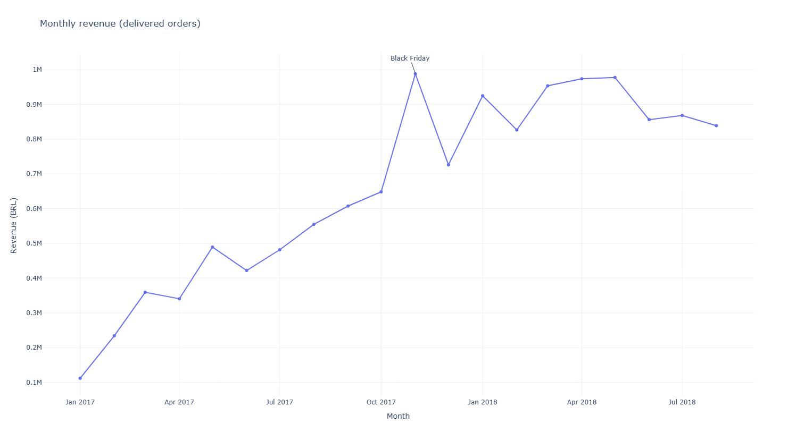
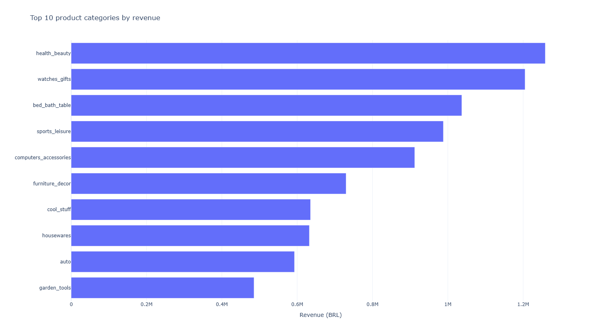
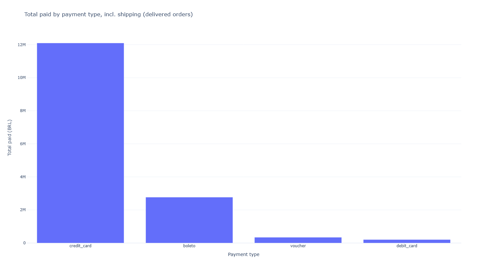

# Olist E-Commerce Sales Analysis

SQL and Python analysis of the Olist Brazilian e-commerce dataset (about 100k orders, 2016 to 2018). I loaded the CSVs into MySQL, answered business questions with SQL, and visualised the results with Python.

## Tools

- MySQL, with queries written in PopSQL
- SQL: joins, CTEs, window functions (`LAG`), `GROUP BY` and `HAVING`
- Python: pandas, SQLAlchemy, PyMySQL, python-dotenv
- Charts: Plotly for the interactive ones (revenue trend, payment types, top categories), Matplotlib and Seaborn for the rest

## Questions answered

1. How are orders split by status?
2. Which products and categories earn the most revenue?
3. Does the category that sells the most items also earn the most?
4. How does monthly revenue change, and what is the month-over-month growth?
5. How do customers pay?
6. Who are the top-spending customers, and who orders repeatedly?

All SQL queries are in `queries/olist_queries.sql`.

## Key findings

- About 97% of orders (96,478 of 99,441) are delivered, so most of the analysis is filtered to delivered orders.
- Monthly revenue grew from about 112k BRL in January 2017 to about 648k in October 2017. November 2017 peaked at about 988k (likely Black Friday), then fell 26.5% in December. In 2018 revenue stayed between about 826k and 978k per month. The data ends in August 2018.
- Credit cards account for about 78% of the money paid (12.1M of 15.4M BRL), and boleto, a Brazilian bank slip, for about 18%.
- health_beauty earns the most revenue (about 1.26M BRL). bed_bath_table sells the most items (11,115) but ranks third in revenue, because its items are cheaper on average.
- Repeat buyers are rare. 8 of the top 10 spenders placed only one order, and the most frequent customer ordered 15 times.

## Charts

The Plotly charts are also saved as interactive HTML files in `charts/`.

## How to run

1. Download the dataset from Kaggle ("Brazilian E-Commerce Public Dataset by Olist") and put the CSV files in a `data/` folder.
2. Create the database in MySQL: `CREATE DATABASE olist;`
3. Copy `.env.example` to `.env` and put your MySQL password in it.
4. Install the packages: `pip install -r requirements.txt`
5. Load the data: `python load_mysql.py`
6. Run the analysis: `python charts.py`. Charts are saved in `charts/`. Set `SHOW = False` in the file to skip the pop-up windows.

## Notes

- Revenue means item price only. Payment totals include shipping, so they are higher.
- Category names are translated to English with the dataset's translation table.
- `product_id` and `customer_unique_id` are hashed in the dataset, so charts show the first 8 characters.